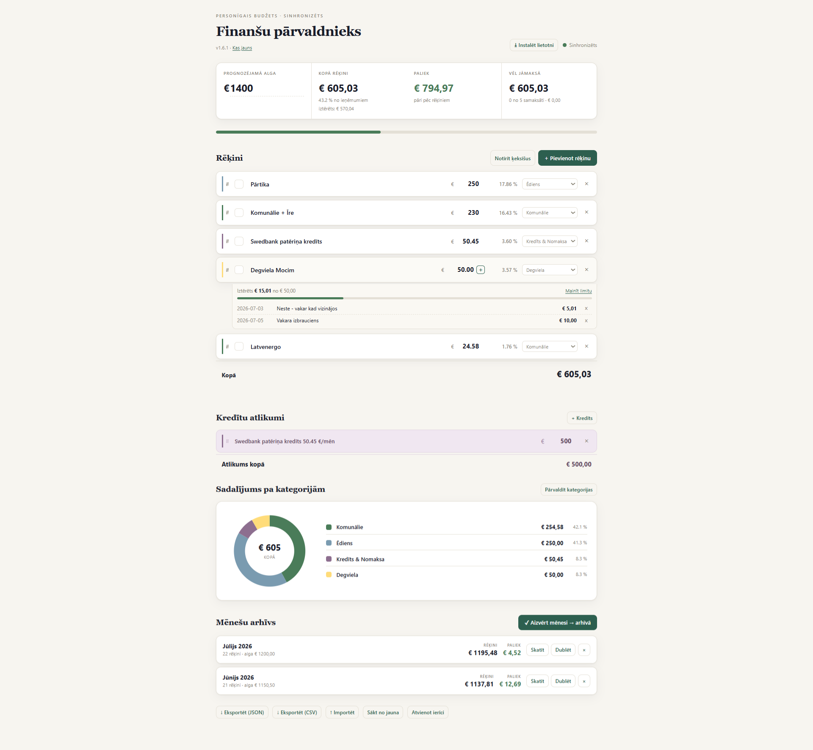

# Finanšu pārvaldnieks

Personīgais budžeta un tēriņu pārvaldnieks — seko līdzi ikdienas rēķiniem, kredītu atlikumiem un tēriņu sadalījumam pa kategorijām. Piesakies ar Google kontu, un dati sinhronizējas starp visām tavām ierīcēm automātiski.



## Ko lietotne dara

- **Pieteikšanās ar Google kontu** — katram lietotājam savs privāts budžets, bez telpas ID
- **Rēķinu un ienākumu pārskats** — redzi uzreiz, cik paliek pāri pēc visiem rēķiniem
- **Divi rēķinu veidi** — parasti (fiksēta summa) un summējošie (piem. degviela — pievieno epizodes visa mēneša garumā, summa saskaitās automātiski, var iestatīt mēneša limitu)
- **Kredītu atlikumu izsekošana**
- **Kategorijas ar krāsu kodējumu** un vizuālu sadalījumu (donut diagramma)
- **Mēnešu arhīvs** — aizver mēnesi un saglabā to vēsturē
- **Datu eksports** — JSON (pilns dublējums) un CSV (Excel/Sheets analīzei)
- **Instalējama kā lietotne** telefonā vai datorā (PWA)

## Versija

Aktuālā versija un pilna izmaiņu vēsture ir redzama pašā lietotnē — spied uz **"Kas jauns"** saiti zem virsraksta.

## Failu struktūra

```
index.html      lapas struktūra
style.css        dizains
app.js            loģika
manifest.json   PWA konfigurācija
sw.js              nodrošina instalējamību un ātru ielādi
icons/            lietotnes ikonas
```

## Datu eksports

Rīkjoslas apakšā ir divas eksporta pogas:
- **JSON** — pilns dublējums, ko var izmantot atjaunošanai (poga "Importēt")
- **CSV** — atver Excel/Google Sheets tālākai analīzei vai arhivēšanai
