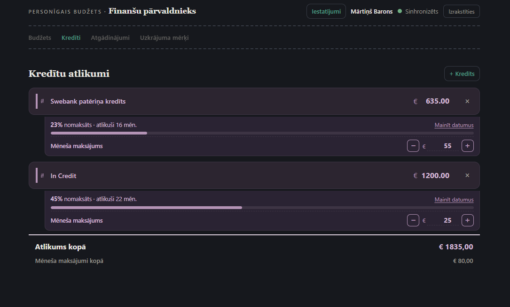

# Finanšu pārvaldnieks

Personīgais budžeta un tēriņu pārvaldnieks — seko līdzi ikdienas rēķiniem, kredītu atlikumiem un tēriņu sadalījumam pa kategorijām. Piesakies ar Google kontu, un dati sinhronizējas starp visām tavām ierīcēm automātiski.

**Lietotne pieejama šeit:** https://mr-bir.github.io/BudzetsIMT/




## Ko lietotne dara

- **Pieteikšanās ar Google kontu** — katram lietotājam savs privāts budžets, bez telpas ID
- **Rēķinu un ienākumu pārskats** — redzi uzreiz, cik paliek pāri pēc visiem rēķiniem
- **Divi rēķinu veidi** — parasti (fiksēta summa) un summējošie (piem. degviela — pievieno epizodes visa mēneša garumā, summa saskaitās automātiski, var iestatīt mēneša limitu)
- **Kredītu atlikumu izsekošana** — atlikumi, termiņi ar progresu un mēneša maksājumi
- **Kategorijas ar krāsu kodējumu** un vizuālu sadalījumu (donut diagramma)
- **Mēnešu arhīvs** — aizver mēnesi un saglabā to vēsturē
- **Datu eksports** — JSON (pilns dublējums) un CSV (Excel/Sheets analīzei)
- **Tumšā un gaišā tēma** — izvēle saglabājas ierīcē
- **Instalējama kā lietotne** telefonā vai datorā (PWA)

## Sadaļas

Lietotne sadalīta četrās sadaļās:

| Sadaļa | Saturs |
|---|---|
| **Budžets** | Alga, rēķini, kategoriju sadalījums, mēnešu arhīvs, eksports/imports |
| **Kredīti** | Kredītu atlikumi, termiņi ar progresu, mēneša maksājumi |
| **Atgādinājumi** | Vēl top — maksājumu termiņu izsekošana |
| **Uzkrājuma mērķi** | Vēl top — uzkrājuma mērķu izvirzīšana un izsekošana |

## Failu struktūra

```
index.html      lapas struktūra
style.css       dizains
app.js          loģika (VERSION un CHANGELOG konstantes faila augšā)
manifest.json   PWA konfigurācija
sw.js           nodrošina instalējamību un ātru ielādi
icons/          lietotnes ikonas
screenshots/    ekrānuzņēmumi
```

## Datu eksports

Rīkjoslas apakšā ir divas eksporta pogas:

- **JSON** — pilns dublējums, ko var izmantot atjaunošanai (poga "Importēt")
- **CSV** — atver Excel/Google Sheets tālākai analīzei vai arhivēšanai

## Tehnoloģijas

- Tīrs HTML/CSS/JavaScript bez ietvariem
- **Firebase Firestore** — datu sinhronizācija starp ierīcēm
- **Firebase Authentication** — Google pieteikšanās
- **PWA** — service worker + manifest, instalējama kā vietējā lietotne
- Izvietots uz **GitHub Pages**

## Versija

Aktuālā versija un izmaiņu vēsture ir redzama arī pašā lietotnē — **Iestatījumi → "Kas jauns"**.

---

## Izmaiņu vēsture

### v1.14.1 — 2026-07-17
- Novērsta lapas nobīde, pārslēdzoties uz tukšajām sadaļām

### v1.14.0 — 2026-07-17
- Navigācijas ikonas noņemtas — palikuši tikai teksta nosaukumi
- Lietotnes nosaukums pārcelts uz augšējo joslu un vairs nemainās pa sadaļām
- Navigācija atdalīta ar punktētajām līnijām augšā un apakšā
- Pievienota sadaļa "Uzkrājuma mērķi" (vēl top)

### v1.13.0 — 2026-07-15
- Konta un lietotnes pogas pārceltas uz augšējo labo malu
- Pievienota "Iestatījumi" sadaļa ar tēmas izvēli, versiju un "Kas jauns"
- Virsraksts tagad rāda, kurā sadaļā atrodies

### v1.12.0 — 2026-07-15
- Lietotne sadalīta trīs sadaļās ar ikonu navigāciju augšā
- Kredītu atlikumi pārcelti uz atsevišķu sadaļu, lai budžeta skats būtu pārskatāmāks
- Pievienota sadaļa "Atgādinājumi" (vēl top)

### v1.11.2 — 2026-07-15
- Lietotnes krāsa (theme color) saskaņota ar jauno ikonu

### v1.11.1 — 2026-07-15
- Jauna lietotnes ikona; tā redzama arī virsraksta priekšā

### v1.11.0 — 2026-07-03
- Pievienota poga "Sakārtot" — kārto rēķinus pēc samaksāts statusa, tad pēc summas (lielākā augšā)

### v1.10.1 — 2026-07-03
- Salabots: kredīta atlikums pēc "−"/"+" tagad noapaļojas uz 2 cipariem aiz komata

### v1.10.0 — 2026-07-03
- Kredītiem pievienots mēneša maksājuma lauks ar "−"/"+" pogām atlikuma samazināšanai
- Zem kredītiem pievienota mēneša maksājumu kopsumma blakus "Atlikums kopā"

### v1.9.1 — 2026-07-03
- Salabots: ievadlauku teksts modālajos logos tagad redzams arī tumšajā tēmā

### v1.9.0 — 2026-07-03
- Pievienota tumšā tēma (Dark Theme) — pārslēdz ar ikonu augšā pie versijas
- Tēmas izvēle tiek saglabāta lokāli katrā ierīcē

### v1.8.1 — 2026-07-03
- Arhīva skatā pievienota kredītu "Atlikums kopā" summa

### v1.8.0 — 2026-07-03
- Kredītu atlikumiem pievienoti neobligāti sākuma/beigu datumi
- Rāda nomaksas progresu pēc laika: cik % nomaksāts un cik mēneši atlikuši

### v1.7.2 — 2026-07-03
- Noņemta "Importēt vecos datus" poga (migrācija pabeigta)

### v1.7.1 — 2026-07-03
- Novērsta pieteikšanās problēma — pāreja uz uznirstošo logu (popup), jo pārlūki bloķēja iepriekšējo metodi

### v1.7.0 — 2026-07-03
- Pieteikšanās ar Google kontu — katram lietotājam savs privāts budžets
- Aizvietota vecā telpas ID sistēma; dati aizsargāti ar īstiem drošības noteikumiem
- Pievienota "Importēt vecos datus" poga migrācijai no vecās versijas

### v1.6.1 — 2026-07-03
- Arhīva rediģētāja rinda vertikālā telefonā vairs nav saspiesta — paliek vienā līmenī

### v1.6.0 — 2026-07-02
- Summējošiem rēķiniem pievienots neobligāts mēneša limits (plānotais maksimums)
- "Kopā rēķini" rēķina no limita; pievienota "iztērēts" info un progresa josla pie pozīcijas

### v1.5.0 — 2026-07-02
- Pievienots summējošs rēķina veids (piem. degviela) — krājas visu mēnesi ar "+" epizodēm
- Katra epizode saglabājas ar summu, piezīmi un datumu; atsevišķas epizodes var dzēst
- Jaunu rēķinu pievienojot, var izvēlēties veidu: parasts vai summējošs

### v1.4.0 — 2026-07-02
- Dzēšot rēķinu, kredīta atlikumu vai kategoriju, tagad tiek prasīts apstiprinājums

### v1.3.0 — 2026-07-02
- Pievienota "Importēt" poga — eksportēto JSON rezerves kopiju var ielādēt atpakaļ

### v1.2.0 — 2026-07-02
- Pievienota versijas numura rādīšana zem virsraksta un "Kas jauns" (changelog) logs

### v1.1.2 — 2026-07-02
- Atjauninātas noklusētās paraugvērtības jauniem lietotājiem (neitrāli dati)
- Pievienotas "Pārtika" un "Īre" noklusētās kategorijas

### v1.1.1 — 2026-07-02
- Kredītu atlikumiem pievienota pārkārtošana (drag & drop) un vienots dzēšanas dizains

### v1.1.0 — 2026-07-02
- Kategorijas tagad pilnībā pārvaldāmas: pievienot, pārsaukt, mainīt krāsu, dzēst
- Kategorijas glabājas Firebase un sinhronizējas starp ierīcēm

### v1.0.6 — 2026-07-02
- Novērsta problēma, kad ātri rakstot kursors izlēca no lauka (sinhronizācija vairs netraucē rakstīšanai)

### v1.0.5 — 2026-07-02
- Arhīva rediģētājs: pievienota "Labot" poga — lauki sākotnēji tikai skatāmi, atbloķējas pēc nospiešanas
- Atgriezta samaksas statusa atzīme ("Samaksāts" / "Nav samaksāts") un € zīme summām

### v1.0.4 — 2026-07-02
- Arhīva ieraksts kļuvis pilnībā rediģējams (alga, rēķini, kredīti, secība) ar melnraksta aizsardzību
- Pievienota arhīva ierakstu dublēšana un pārsaucams nosaukums

### v1.0.3 — 2026-07-02
- Rēķiniem pievienota pārkārtošana ar drag & drop
- Pievienota maksājumu izsekošana ar ķeksīšiem ("Vēl jāmaksā")

### v1.0.2 — 2026-07-02
- Pievienots mēnešu arhīvs ("Aizvērt mēnesi" → momentuzņēmums)
- Pievienoti grafiki (sadalījums pa kategorijām) ar riņķa diagrammu

### v1.0.1 — 2026-07-02
- Vairāki izkārtojuma labojumi (dzēšanas × pozīcija, viena kolonna datorā)

### v1.0.0 — 2026-07-02
- Pirmā versija: rēķini, kredītu atlikumi, alga, "Paliek" aprēķins
- Datu sinhronizācija starp ierīcēm caur Firebase
