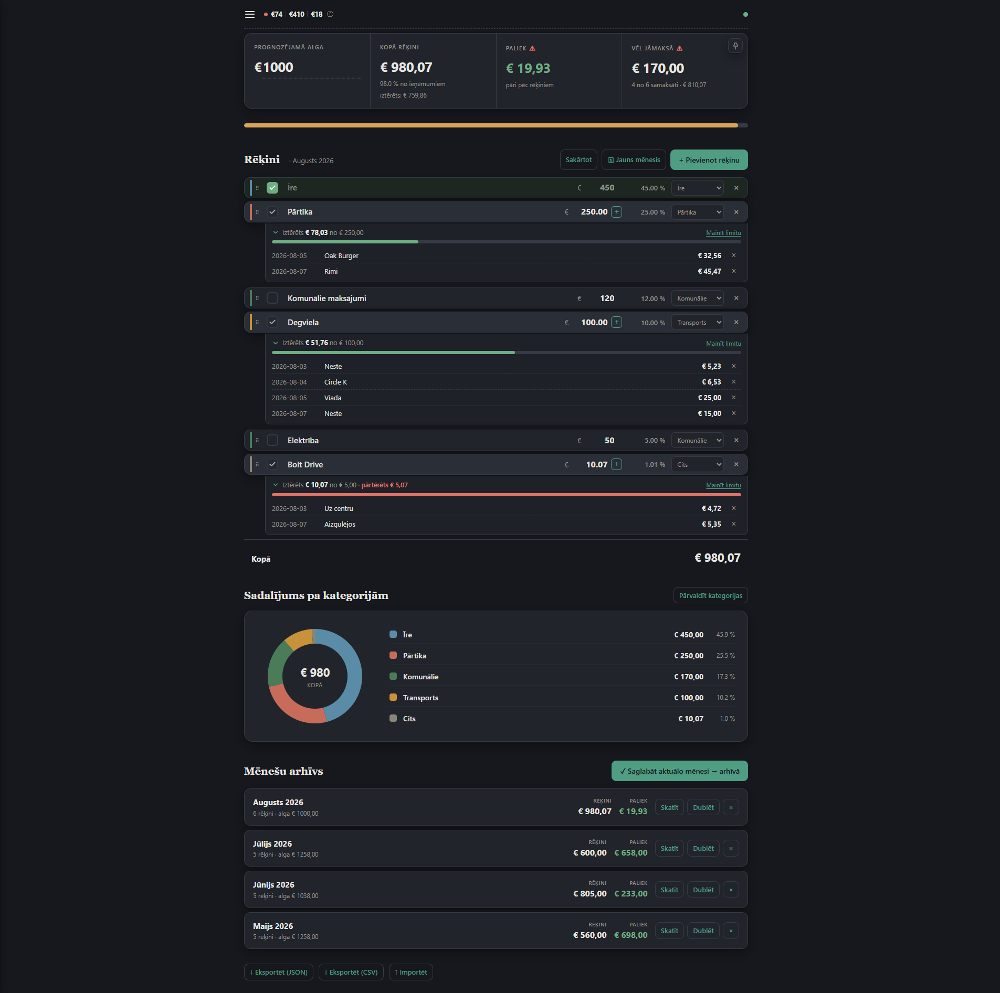
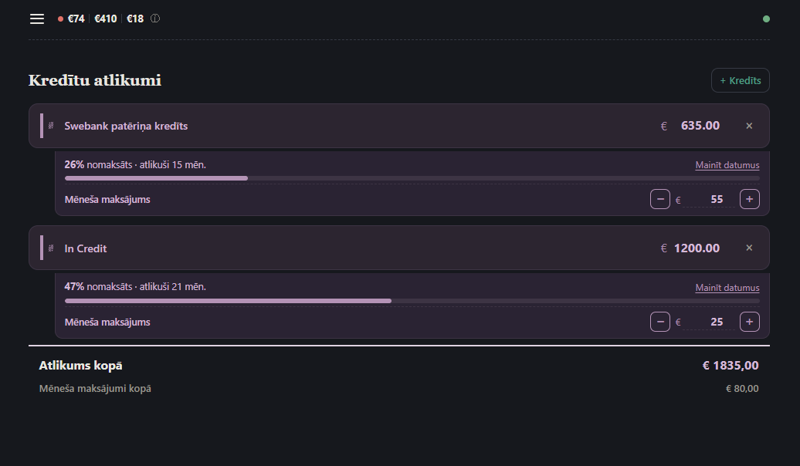
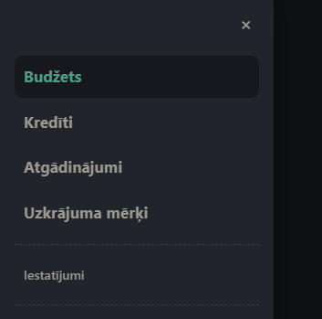
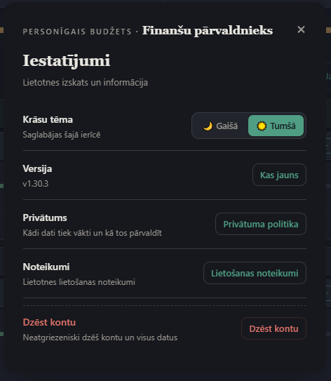

# Finanšu pārvaldnieks

Personīgais budžeta un tēriņu pārvaldnieks — seko līdzi ikdienas rēķiniem, kredītu atlikumiem un tēriņu sadalījumam pa kategorijām. Piesakies ar Google kontu, un dati sinhronizējas starp visām tavām ierīcēm automātiski.

**Lietotne pieejama šeit:** https://mr-bir.github.io/BudzetsIMT/









## Ko lietotne dara

- **Pieteikšanās ar Google kontu** — katram lietotājam savs privāts budžets, bez telpas ID
- **Rēķinu un ienākumu pārskats** — redzi uzreiz, cik paliek pāri pēc visiem rēķiniem
- **Divi rēķinu veidi** — parasti (fiksēta summa) un summējošie (piem. degviela — pievieno epizodes visa mēneša garumā, summa saskaitās automātiski, var iestatīt mēneša limitu)
- **Kredītu atlikumu izsekošana** — atlikumi, termiņi ar progresu un mēneša maksājumi
- **Atgādinājumi** — piesaisti atgādinājumu esošam rēķinam (atkārtojas katru mēnesi izvēlētajā dienā, automātiski pārdzīvo "Jauns mēnesis") vai izveido brīvu vienreizēju atgādinājumu; baneris un sarkans skaitītājs parāda, kad kaut kam termiņš ir šodien vai nokavēts
- **Kategorijas ar krāsu kodējumu** un vizuālu sadalījumu (donut diagramma)
- **Mēnešu arhīvs** — aizver mēnesi un saglabā to vēsturē, ar rediģējamu perioda nosaukumu
- **Naudas tērēšanas tempa indikators** — vidējais tēriņš/dienā un droša tēriņa summa līdz mēneša beigām
- **Datu eksports** — JSON (pilns dublējums) un CSV (Excel/Sheets analīzei)
- **Tumšā un gaišā tēma** — izvēle saglabājas ierīcē
- **Kompakta, mobilajām ierīcēm draudzīga navigācija** — sānu izvēlne ar visām sadaļām un kontu
- **Instalējama kā lietotne** telefonā vai datorā (PWA)
- **Papildu aizsardzība pret ļaunprātīgu piekļuvi** (Firebase App Check)
- **Privātuma politika un lietošanas noteikumi** pieejami tieši lietotnē (Iestatījumi)
- **Konta un datu dzēšana** vienā vietā (Iestatījumi → "Dzēst kontu") — neatgriezeniski dzēš visus datus un pašu kontu

## Sadaļas

Lietotne sadalīta četrās sadaļās (pieejamas caur sānu izvēlni):

| Sadaļa | Saturs |
|---|---|
| **Budžets** | Alga, rēķini, kategoriju sadalījums, mēnešu arhīvs, eksports/imports |
| **Kredīti** | Kredītu atlikumi, termiņi ar progresu, mēneša maksājumi |
| **Atgādinājumi** | Maksājumu termiņu atgādinājumi — piesaistīti rēķinam (atkārtojas mēnesi) vai brīvi (vienreizēji); baneris un skaitītājs, kad termiņš tuvojas. *Native paziņojumi ierīcē (Android) vēl top.* |
| **Uzkrājuma mērķi** | Vēl top — uzkrājuma mērķu izvirzīšana un izsekošana |

## Failu struktūra

```
index.html                    lapas struktūra
style.css                     dizains
app.js                        loģika (VERSION konstante atvasināta no changelog.js)
changelog.js                  pilna versiju/izmaiņu vēsture (ES modulis)
manifest.json                 PWA konfigurācija
sw.js                         nodrošina instalējamību un ātru ielādi
privatuma-politika.html       privātuma politika (arī atveras lietotnē pašā, Iestatījumos)
lietosanas-noteikumi.html     lietošanas noteikumi (arī atveras lietotnē pašā, Iestatījumos)
icons/                        lietotnes ikonas
screenshots/                  ekrānuzņēmumi
js/                           bundler-free Capacitor/Firebase-Auth palīgmoduļi native Android pieteikšanās atbalstam (uz publiskā tīmekļa neaktīvi)
capacitor/                    native Android (Capacitor) projekts — atsevišķa, ar web versiju sinhronizēta www/ kopija
LICENSE                       autortiesību piezīme (visas tiesības paturētas)
```

## Datu eksports

Rīkjoslas apakšā ir divas eksporta pogas:

- **JSON** — pilns dublējums, ko var izmantot atjaunošanai (poga "Importēt")
- **CSV** — atver Excel/Google Sheets tālākai analīzei vai arhivēšanai

## Tehnoloģijas

- Tīrs HTML/CSS/JavaScript bez ietvariem
- **Firebase Firestore** — datu sinhronizācija starp ierīcēm, ar UID balstītiem drošības noteikumiem
- **Firebase Authentication** — Google pieteikšanās
- **Firebase App Check** (reCAPTCHA Enterprise) — aizsardzība pret automatizētu ļaunprātīgu piekļuvi
- **PWA** — service worker + manifest, instalējama kā vietējā lietotne
- Izvietots uz **GitHub Pages**

## Versija

Aktuālā versija: **v1.32.0**. Pilna izmaiņu vēsture ir redzama pašā lietotnē — **Iestatījumi → "Kas jauns"** — un `changelog.js` failā, kas ir vienīgais versiju vēstures avots (šis README zemāk rāda tikai nesenās izmaiņas).

## Licence

Šis projekts tiek izplatīts ar autortiesībām — **visas tiesības paturētas**. Skatīt `LICENSE` failu repozitorija saknē. Kopēšana, modificēšana vai izplatīšana bez autora atļaujas nav atļauta.

---

## Nesenās izmaiņas

Pilnu vēsturi kopš v1.0.0 skatīt `changelog.js` vai lietotnē (Iestatījumi → "Kas jauns").

### v1.32.0 — 2026-08-09
- Pievienota Atgādinājumu sadaļa — atgādinājumu var piesaistīt esošam rēķinam (atkārtojas katru mēnesi izvēlētajā dienā, automātiski pārdzīvo "Jauns mēnesis") vai izveidot brīvu vienreizēju atgādinājumu ar fiksētu datumu
- Kad rēķins tiek izslēgts no jaunā mēneša (vai izdzēsts), tam piesaistītais atgādinājums automātiski pāriet pauzes stāvoklī, nevis pazūd
- Pievienots sarkans skaitītājs pie "Atgādinājumi" izvēlnē un baneris visās sadaļās, kad kādam atgādinājumam termiņš ir šodien vai nokavēts

### v1.31.0 — 2026-08-09
- Kredītu sadaļas ieraksti vizuāli saskaņoti ar Rēķinu sadaļu — vienādas krāsas, izmēri un atstarpes

### v1.30.3 — 2026-08-08
- Drošības uzlabojums — kategoriju krāsu vērtības tagad vienmēr tiek pārbaudītas pirms attēlošanas
- Salabota kļūda, kad lietotnes automātiskā atjaunināšana varēja pārtraukt lietotāju rakstīšanas vidū
- Firestore drošības noteikumi paplašināti ar padziļinātu datu validāciju un App Check pārbaudi

### v1.30.2 — 2026-08-08
- Pabeigta native Android pieteikšanās/izrakstīšanās funkcionalitāte — pievienoti nepieciešamie palīgmoduļi, lai tā reāli darbotos; web/PWA lietotāju plūsma nemainās

### v1.30.1 — 2026-08-06
- Pievienots native Android pieteikšanās/izrakstīšanās ceļš (Capacitor) — web/PWA lietotāju plūsma nemainās

### v1.30.0 — 2026-08-05
- Privātuma politika un Lietošanas noteikumi tagad atveras lietotnē pašā (modālī), nevis jaunā pārlūka cilnē

### v1.29.0 — 2026-08-05
- Pievienota Lietošanas noteikumu lapa un saite uz to Iestatījumos

### v1.28.0 — 2026-08-05
- Pievienota "Dzēst kontu" poga Iestatījumos — neatgriezeniski dzēš visus datus (rēķinus, kredītus, kategorijas, arhīvu) un pašu kontu, ar dubultu apstiprinājumu
- Pievienota Privātuma politikas lapa un saite uz to Iestatījumos

### v1.27.1 — 2026-08-05
- Salabota kļūda, kad lēna interneta savienojuma dēļ (nevis novecojuša pārlūka dēļ) parādījās maldīgs "vajag jaunāku pārlūku" ziņojums

### v1.27.0 — 2026-08-05
- Naudas tērēšanas tempa indikators pārcelts no Budžets sadaļas uz augšējo joslu (topbar) — tagad redzams visās sadaļās
- Aplikācijas ikona noņemta no augšējās joslas, lai atbrīvotu vietu tempa indikatoram

### v1.26.0 — 2026-08-04
- Jauna kompakta augšējā josla — hamburger izvēlne aizstāj iepriekšējo sadaļu joslu un lietotāja/iestatījumu pogas, kas tagad izbīdās kā sānu panelis
- Lietotnes nosaukums pārcelts no augšējās joslas uz Iestatījumu logu

### v1.25.2 — 2026-08-04
- Iekšēji koda uzlabojumi — izmaiņu vēsture (changelog) pārcelta uz atsevišķu failu, versijas numurs tagad tiek atvasināts automātiski — lietotnes darbība nemainās

### v1.25.1 — 2026-08-03
- Drošības uzlabojums — rēķinu, kredītu un algas summu lauki tagad vienmēr tiek attēloti kā droši skaitļi, nevis neapstrādāts teksts

### v1.25.0 — 2026-08-01
- Pievienots naudas tērēšanas tempa indikators — vidējais tēriņš/dienā, reāli pieejamā summa tagad un droša tēriņa summa dienā līdz mēneša beigām, ar krāsainu tempa signālu

### v1.24.1 — 2026-08-01
- "Sakārtot" poga tagad rēķinus kārto vienkārši pēc summas (dilstoši) — vairs negrupē pēc "Samaksāts" statusa

### v1.24.0 — 2026-08-01
- Pievienots draudzīgs ziņojums, ja pārlūkprogramma (WebView) ir pārāk vecs un nespēj palaist lietotni — vairs nav bezgalīga ielādes ekrāna
- Salabota kļūda, kurā ielādes ekrāns nepazuda neautentificētam lietotājam (pirms pieteikšanās)

### v1.23.1 — 2026-08-01
- Arhīva ierakstos noņemts dublējošais kalendārā mēneša nosaukums — tagad rādās tikai rēķinu skaits un alga

### v1.23.0 — 2026-08-01
- Pievienots rediģējams darba perioda nosaukums pie "Rēķini" (piem. "Jūlijs 2026") — klikšķinot uz tā, var mainīt
- Arhivēšana ("Saglabāt aktuālo mēnesi → arhīvā" un "Jauns mēnesis") tagad izmanto šo nosaukumu, nevis klikšķa datumu
- Nospiežot "Jauns mēnesis", perioda nosaukums automātiski atjaunojas uz jauno kalendāro mēnesi

### v1.22.0 — 2026-08-01
- Pievienota poga "Jauns mēnesis" — ļauj izvēlēties, kurus rēķinus paturēt nākamajam mēnesim, ar iespēju vispirms saglabāt aktuālo mēnesi arhīvā

### v1.21.0 — 2026-08-01
- Summējošiem rēķiniem pievienota epizožu saraksta sakļaušana/atvēršana

### v1.20.0 — 2026-08-01
- Sadaļu pogām pievienots slīdošs pasvītrojuma indikators, animēta pāreja starp sadaļām
- Rēķinu saraksts padarīts vēl kompaktāks

### v1.19.x — 2026-07-19 / 2026-08-01
- Kopsavilkuma piespraušanas funkcija (paliek redzams, ritinot lapu) un ar to saistīti labojumi
- Vizuāli/mobilie uzlabojumi rēķinu sarakstam un sadaļu navigācijai

### v1.15.0–1.18.1 — 2026-07-18 / 2026-07-19
- Pievienots Firebase App Check (aizsardzība pret ļaunprātīgu piekļuvi)
- Pārtēriņa brīdinājumi summējošiem rēķiniem ar limitu
- Iekšēji koda uzlabojumi (sadaļu komentāri)

### v1.0.0–1.14.1 — 2026-07-02 / 2026-07-17
Pamatfunkcionalitātes izveide: rēķini, kredīti, kategorijas, mēnešu arhīvs, tumšā tēma, Google pieteikšanās, ekrānuzņēmumu/versijas sistēma. Pilnu sarakstu skatīt `changelog.js`.
